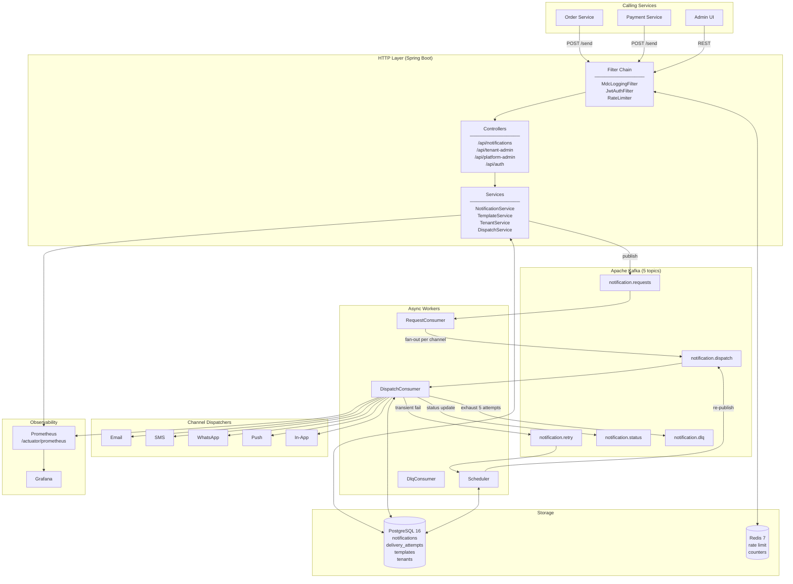
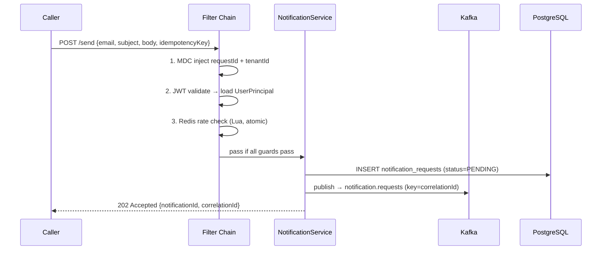
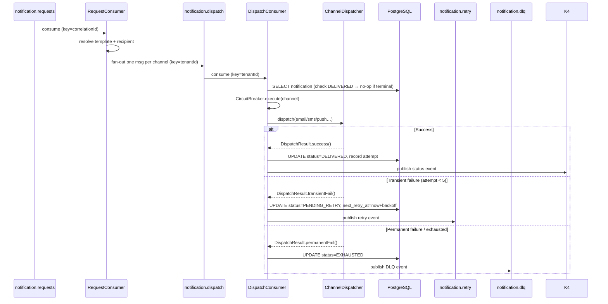
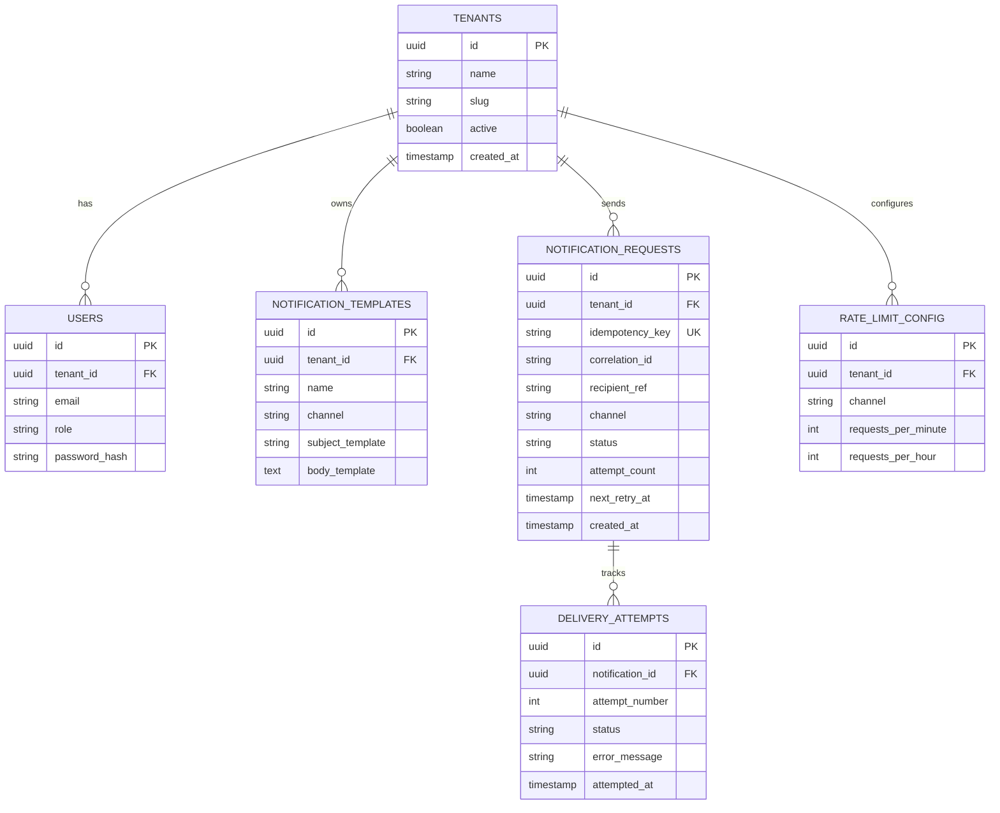

# High-Level Design — Multi-Tenant Notification Service

> **Stack:** Java 21 · Spring Boot 3.3.5 · PostgreSQL 16 · Apache Kafka · Redis 7 · Resilience4j  
> **Target scale:** 20,000 notifications/sec · 1.7 billion/day · 20 instances

---

## 1. Problem Statement

Every product surface eventually needs to notify users — order confirmations, OTP codes, shipping updates, marketing blasts. The naive implementation fires the notification inline inside the business transaction:

```
POST /orders → validate → save order → sendEmail() → return 200
```

This creates three compounding problems at scale:

1. **Latency coupling** — a 400 ms SMTP call inflates order API p99 by the same amount
2. **Reliability coupling** — if SendGrid is down, orders fail too
3. **No auditability** — fire-and-forget leaves no record of what was sent, when, and to whom

This service breaks all three couplings. The HTTP contract is: **always return `202 Accepted` in under 5 ms**. Delivery happens asynchronously through Kafka.

---

## 2. System Architecture



---

## 3. Request Lifecycle

A single `POST /api/notifications/send` call traverses two distinct phases:

### Phase 1 — HTTP (synchronous, <5 ms)



**Key invariants enforced here:**
- `idempotency_key` has a DB UNIQUE constraint → duplicate returns `409 Conflict`, never double-sends
- Rate limit is checked *before* DB write — rejected requests never touch Postgres
- `202` is returned as soon as Kafka `ack=all` confirms the message is durable

---

### Phase 2 — Async Dispatch Pipeline



---

## 4. Kafka Topic Design

| Topic | Partition key | Partitions | Purpose |
|-------|--------------|-----------|---------|
| `notification.requests` | `correlationId` | 10 | Inbound from callers — one message per send request |
| `notification.dispatch` | `tenantId` | 10 | Fan-out per channel — consumed by DispatchConsumer |
| `notification.retry` | `tenantId` | 10 | Retry-eligible messages — polled by Scheduler |
| `notification.status` | `correlationId` | 10 | Delivery outcomes — consumed by upstream services |
| `notification.dlq` | `tenantId` | 1 | Exhausted messages — for ops inspection |

**Why `tenantId` on the dispatch topic?**  
Partitioning by `tenantId` ensures all messages for one tenant land on the same partition, consumed by the same thread in order. A tenant sending 10,000 messages/sec doesn't starve a tenant sending 10/sec — Kafka's consumer group rebalancing keeps partitions balanced across instances.

**Why `correlationId` on the request and status topics?**  
Callers correlate a send request to its delivery outcome via `correlationId`. Keeping these on the same partition preserves ordering so a caller consuming the status topic sees events in the correct sequence.

---

## 5. Rate Limiting Design

Standard Spring rate limiters (Bucket4j, Resilience4j RateLimiter) use in-memory state — they fail silently across instances. Under 20 instances all sharing the same quota, in-memory means each instance sees only 1/20th of actual traffic.

**Solution: Redis Lua atomic dual-window limiter**

```
┌─────────────────────────────────────────────────────────┐
│  Redis key: rate:{tenantId}:{channel}:min:{minute}      │
│  Redis key: rate:{tenantId}:{channel}:hr:{hour}         │
│                                                         │
│  Single Lua script (atomic):                            │
│    1. INCR minute counter  (TTL = 60s)                  │
│    2. INCR hour counter    (TTL = 3600s)                │
│    3. If either > limit → return RATE_LIMITED           │
│    4. Else → return ALLOWED                             │
└─────────────────────────────────────────────────────────┘
```

The script executes atomically — no two threads can observe a stale counter. The TTL auto-expires counters without a cleanup job.

**Fallback:** If Redis is unreachable, `RedisRateLimiterRegistry` falls back to per-instance `TokenBucket` (in-memory). This degrades accuracy (each instance allows up to `limit` instead of `limit/N`) but never blocks traffic entirely — correct for a notification service where false-positives (blocking a valid send) are worse than false-negatives (allowing a brief burst).

---

## 6. Resilience Design

### Circuit Breaker per Channel

```
email   ──[CB:email  ]──► EmailDispatcher
sms     ──[CB:sms    ]──► SmsDispatcher
push    ──[CB:push   ]──► PushDispatcher
whatsapp──[CB:whatsapp]──► WhatsAppDispatcher
in_app  ──[CB:in_app ]──► InAppDispatcher
```

One circuit breaker per channel (Resilience4j, COUNT_BASED). Configuration:
- Opens after **50% failure rate** in a **10-call sliding window** (minimum 5 calls)
- Half-open probe after **60 seconds** (30s for in-app, 120s for WhatsApp)
- Three probe calls allowed before fully closing

**Why per-channel, not per-tenant?**  
Provider outages (SendGrid down, Twilio maintenance) affect all tenants equally. Scoping by channel isolates the failure to the provider. Scoping by tenant would require N×M breakers (N tenants × M channels) and would never open if each tenant has low individual volume.

### Retry Backoff

| Attempt | Delay | Formula |
|---------|-------|---------|
| 1 | Immediate | — |
| 2 | 30 s | `initial_delay_seconds` |
| 3 | 120 s | `× backoff_multiplier (4)` |
| 4 | 480 s | `× 4` |
| 5 | 1920 s | `× 4` |
| → DLQ | — | status = EXHAUSTED |

The `Scheduler` polls `notification_requests WHERE status=PENDING_RETRY AND next_retry_at <= NOW()` every 10 seconds and re-publishes to `notification.retry`. The retry consumer re-enters the dispatch pipeline — no special retry code path.

---

## 7. Security Model

Three independent guards applied in order. All three must pass.

```
Request
  │
  ▼
┌─────────────────────────────────┐
│ Guard 1: JWT Authentication     │  → 401 if token missing/invalid/expired
│  JwtAuthFilter                  │
│  HS384 signature validation     │
│  UserDetailsService lookup      │
└────────────────┬────────────────┘
                 │
                 ▼
┌─────────────────────────────────┐
│ Guard 2: Role-based Access      │  → 403 if role insufficient
│  SecurityConfig (Spring Sec 6)  │
│  PLATFORM_ADMIN → /api/platform │
│  TENANT_ADMIN  → /api/tenant    │
└────────────────┬────────────────┘
                 │
                 ▼
┌─────────────────────────────────┐
│ Guard 3: Tenant Isolation       │  → 403 if tenantId mismatch
│  assertTenantAccess()           │
│  JWT.tenantId == URL.tenantId   │
│  PLATFORM_ADMIN bypasses        │
└────────────────┬────────────────┘
                 │
                 ▼
          Handler logic
```

**Non-obvious fix — Spring Boot `/error` forwarding:**  
When Spring Security throws `AccessDeniedException` (Guard 2 fails), Spring Boot internally forwards the request to `/error` to render the error response. This internal forward carries no `Authorization` header. Without explicitly permitting `/error`, the JWT filter sees no token on the error dispatch → falls through to `AnonymousAuthenticationFilter` → returns `401` instead of `403`.

Fix: `.requestMatchers("/error").permitAll()` in `SecurityConfig`.

**ArchUnit enforcement:**  
A dedicated test class asserts at build time:
- No repository called directly from a controller
- Every service method touching tenant data calls `assertTenantAccess` first
- No `System.out.println` anywhere in the codebase

---

## 8. Data Model



**Schema is owned by Flyway** — three migrations:
- `V1__initial_schema.sql` — core tables
- `V2__rate_limit_config.sql` — per-tenant rate limit table
- `V3__add_recipient_ref.sql` — recipient reference column with NOT NULL constraint

---

## 9. Observability

### Structured Logging (MDC)

Every log line is tagged with three MDC fields injected by `MdcLoggingFilter` before any handler runs:

```
2026-06-22 17:50:58 INFO [96527734 acme-corp order-123] DispatchService - Dispatching EMAIL
                          ──────── ───────── ─────────
                          requestId tenantId  correlationId
```

Filter by `requestId` to trace one HTTP request end-to-end. Filter by `correlationId` to trace one order's notifications across all Kafka hops.

### Custom Metrics (Micrometer → Prometheus)

| Metric | Tags | Alert on |
|--------|------|----------|
| `notifications.dispatched` | `channel`, `tenant_id` | drop in rate |
| `notifications.failed` | `channel`, `tenant_id` | spike > baseline |
| `notifications.retried` | `channel`, `tenant_id` | sustained elevation |
| `notifications.dlq` | `channel`, `tenant_id` | any non-zero |
| `rate_limit.rejected` | `tenant_id` | spike (tenant quota hit) |
| `notification.dispatch.duration` | `channel` | p99 > SLA |

`notification.dispatch.duration` is configured with a percentile histogram (P50/P95/P99) for channel-level latency SLA tracking.

---

## 10. Key Design Decisions

| Decision | Choice | Alternative considered | Reason |
|----------|--------|----------------------|--------|
| Async delivery | Kafka | RabbitMQ / Redis Streams | Durability, replay, per-partition ordering, horizontal scale |
| Rate limiting | Redis Lua atomic | Bucket4j in-memory | Correct across 20 instances; in-memory fails silently |
| Circuit breaker | Resilience4j per-channel | Per-tenant | Provider outages affect all tenants; per-tenant never opens at low volume |
| Schema management | Flyway | Liquibase | Simpler SQL-first model; `ddl-auto: validate` prevents runtime surprises |
| Thread model | Java 21 virtual threads | Platform threads | 200 concurrent dispatches at near-zero OS thread overhead |
| Retry mechanism | DB-polled scheduler | Kafka delayed messages | No Kafka delay plugin needed; scheduler gives exact `next_retry_at` control |
| Tenant isolation | Row-level + ArchUnit | DB schemas per tenant | Single schema is operationally simpler; ArchUnit prevents regression |

---

## 11. Production Checklist (Not in Scope)

The following are stubs or dev-mode implementations intentionally left out of this take-home:

- [ ] Channel dispatchers call real provider SDKs (SendGrid, Twilio, FCM) — currently return stub success
- [ ] Redis Cluster for rate limiter HA (currently single Redis node)
- [ ] Kafka replication factor ≥ 3, `min.insync.replicas=2` (currently single-broker dev setup)
- [ ] Recipient lookup from a user-profile service (currently caller passes recipient directly)
- [ ] Webhook callbacks for delivery confirmation from providers
- [ ] Admin UI for template management (currently REST API only)
- [ ] Secret rotation for `JWT_SECRET` via Vault / AWS Secrets Manager

---

## References

| Document | Location |
|----------|----------|
| ADR-001: Kafka over direct HTTP | [`docs/adr/ADR-001-kafka-async.md`](adr/ADR-001-kafka-async.md) |
| ADR-002: Virtual threads | [`docs/adr/ADR-002-virtual-threads.md`](adr/ADR-002-virtual-threads.md) |
| ADR-003: Redis rate limiting | [`docs/adr/ADR-003-redis-rate-limiting.md`](adr/ADR-003-redis-rate-limiting.md) |
| Domain model details | [`docs/context/domain-model.md`](context/domain-model.md) |
| Kafka topology | [`docs/context/kafka-topology.md`](context/kafka-topology.md) |
| Tenant isolation rules | [`docs/context/tenant-isolation.md`](context/tenant-isolation.md) |
| Observability guide | [`docs/context/observability.md`](context/observability.md) |
| Production scale limits | [`docs/context/production-scale.md`](context/production-scale.md) |
